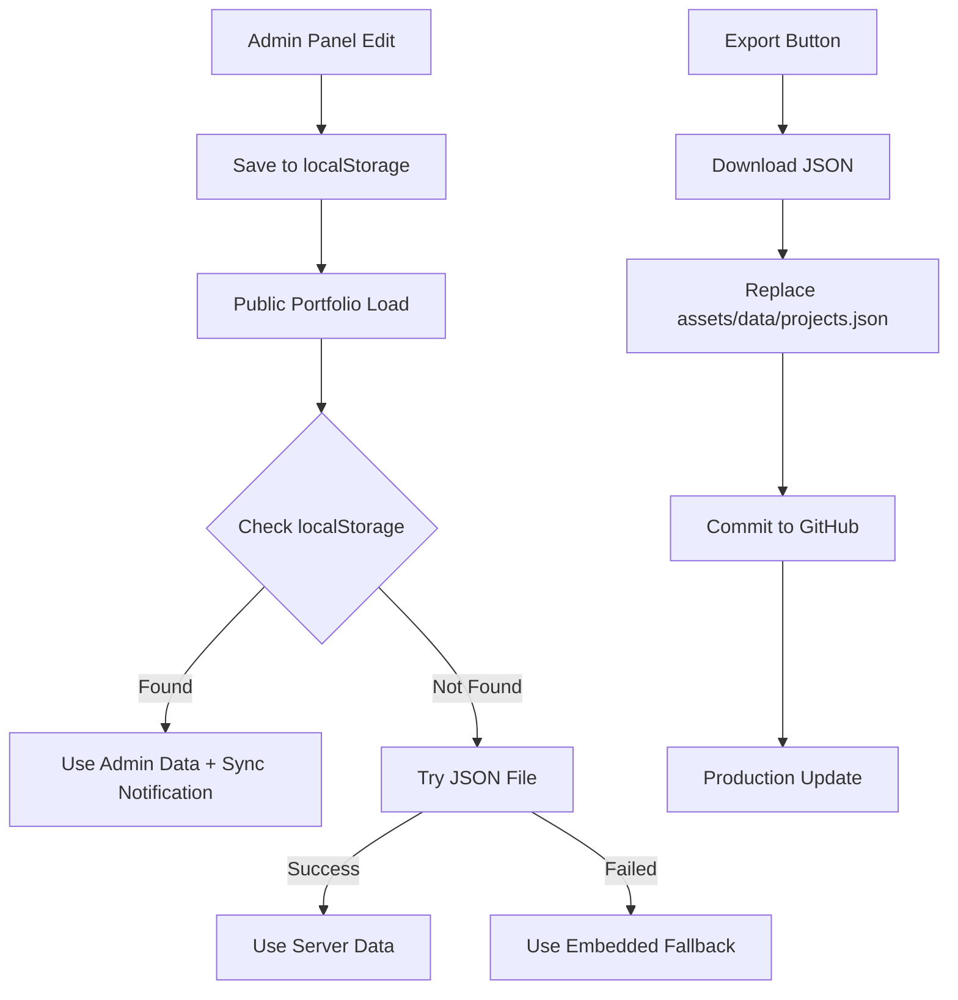

# 🚀 Ahnaf Bawedan - Portfolio Website

> **Mobile Developer | Fullstack Developer | UI/UX Designer**


Modern, responsive portfolio website with integrated admin panel for project management. Built with HTML5, CSS3, JavaScript, and Tailwind CSS.

## 🌟 **Features**

### **Public Portfolio**

- ✅ Responsive design for all devices
- ✅ Interactive project showcase
- ✅ Skills and experience timeline
- ✅ Contact form with email integration
- ✅ Dark/Light mode toggle
- ✅ SEO optimized
- ✅ Fast loading with optimized assets

### **Admin Panel**

- ✅ Secure authentication system
- ✅ Project CRUD operations
- ✅ Real-time data synchronization
- ✅ JSON import/export functionality
- ✅ Mobile-friendly interface
- ✅ Data backup and restore

### **Advanced Features**

- ✅ Auto-sync between admin and public portfolio
- ✅ Three-tier data loading system
- ✅ Offline-first approach
- ✅ Visual admin tools integration

## 🎯 **Live Demo**

- **🌐 Portfolio:** [https://ahnafbwd.github.io/ahnafbawedan/](https://ahnafbwd.github.io/ahnafbawedan/)
- **🔐 Admin Panel:** [https://ahnafbwd.github.io/ahnafbawedan/welcome.html](https://ahnafbwd.github.io/ahnafbawedan/welcome.html)

## 📁 **Project Structure**

```
ahnafbawedan/
├── 📄 index.html              # Public portfolio
├── 🔐 auth.html               # Authentication page
├── ⚙️ project.html            # Admin panel (CRUD)
├── 🏠 welcome.html            # Landing page
├── 📊 assets/
│   ├── 🎨 css/               # Stylesheets
│   ├── 🖼️ image/             # Project images
│   ├── 👤 photo/             # Profile photos
│   ├── 🎯 icon/              # Tech stack icons
│   ├── 📁 data/
│   │   └── projects.json     # Project data
│   └── 🔧 js/
│       ├── projects-data.js  # Data management
│       ├── projects.js       # Project renderer
│       ├── emailjs-config.js # Email configuration
│       └── email-fallback.js # Email fallback
└── 📚 docs/                  # Documentation files
```

## 🚀 **Quick Start**

### **1. Clone Repository**

```bash
git clone https://github.com/ahnafbwd/ahnafbawedan.git
cd ahnafbawedan
```

### **2. Open Portfolio**

```bash
# Option 1: Direct file access
open index.html

# Option 2: Local server (recommended)
python -m http.server 8000
# Then visit: http://localhost:8000
```

### **3. Admin Access**

1. Visit `welcome.html`
2. Click "Admin Login"
3. First-time setup: Create admin credentials
4. Login and manage projects

## 🔐 **Authentication System**

### **First Time Setup**

1. **Access admin panel** → Automatic setup prompt
2. **Create credentials** → Username + Password (min 6 chars)
3. **Login** → Session created with expiry
4. **Start managing** → Full CRUD access

### **Login Process**

```
User → welcome.html → auth.html → Setup/Login → project.html
  ↓                                              ↑
index.html (Public)                        Session Check
```

### **Session Management**

- **Remember me:** 30 days
- **Normal session:** 24 hours
- **Auto-logout:** When expired
- **Password reset:** Available in login page

### **Security Features**

- ✅ Session-based authentication
- ✅ Password hashing (simple hash)
- ✅ Protected admin routes
- ✅ Auto-redirect for unauthorized access
- ✅ Persistent login option

⚠️ **Note:** This is a client-side auth system suitable for personal portfolios. For production apps, use server-side authentication.

## 📊 **Data Management System**

### **Three-Tier Data Loading**

```
Priority 1: localStorage (Admin Data)    ← Highest priority
    ↓ (if not available)
Priority 2: projects.json (Server Data)  ← Medium priority
    ↓ (if failed)
Priority 3: Embedded Data (Fallback)     ← Lowest priority
```

### **Data Flow**



### **Admin Panel Features**

#### **Project Management**

- ✅ Add new projects with rich metadata
- ✅ Edit existing projects with form validation
- ✅ Delete projects with confirmation
- ✅ Real-time preview and validation

#### **Data Operations**

- ✅ **Import:** Upload JSON file to load projects
- ✅ **Export:** Download current projects as JSON
- ✅ **Reload:** Refresh from server/embedded data
- ✅ **Auto-save:** Changes saved to localStorage

#### **Form Fields**

```javascript
{
  title: "Project Title",
  category: "mobile|web|design",
  description: "Project description",
  technologies: ["Tech1", "Tech2"],
  features: ["Feature1", "Feature2"],
  status: "Completed|In Progress|On Hold",
  year: "2024",
  client: "Client Name",
  image: "assets/image/project.png",
  links: {
    project: "https://project-url.com",
    github: "https://github.com/repo"
  }
}
```

## 🔄 **Sync System**

### **Development Workflow**

1. **Edit in admin panel** → Data saved to localStorage
2. **View public portfolio** → Changes appear instantly
3. **Admin tools available** → If logged in as admin
4. **Manual refresh** → Force reload if needed

### **Production Workflow**

1. **Bulk edit projects** → Use admin panel
2. **Export JSON** → Click "Export JSON" button
3. **Replace file** → Update `assets/data/projects.json`
4. **Deploy** → Commit and push to GitHub
5. **Live update** → Portfolio updates automatically

### **Admin Tools (Public Portfolio)**

When logged in as admin, public portfolio shows:

```html
<!-- Floating Admin Button (bottom-left) -->
🔧 Admin Tools: ├── 🔄 Refresh Projects ├── ⚙️ Manage (→ Admin Panel) └── ❌
Hide Toolbar
```

### **Sync Status Indicators**

- 🔵 **Blue notification:** "Projects Updated!" (from admin data)
- 🟢 **Green notification:** Successful operation
- 🔴 **Red notification:** Error occurred
- 🟡 **Yellow notification:** Warning/fallback data

## 🎨 **Customization**

### **Project Categories**

```javascript
// Add new categories in:
// 1. Admin panel form options
// 2. projects.js rendering logic
const categories = {
  mobile: "Mobile App",
  web: "Web Application",
  design: "UI/UX Design",
  // Add your custom categories here
};
```

### **Theme Customization**

```css
/* assets/css/style.css */
:root {
  --primary: #4f46e5; /* Primary color */
  --secondary: #10b981; /* Secondary color */
  --dark: #1f2937; /* Dark text */
  --light: #f9fafb; /* Light background */
}
```

### **Email Configuration**

```javascript
// assets/js/emailjs-config.js
emailjs.init("YOUR_PUBLIC_KEY");

const emailConfig = {
  serviceId: "YOUR_SERVICE_ID",
  templateId: "YOUR_TEMPLATE_ID",
};
```

## 🔧 **Development**

### **Adding New Features**

#### **1. New Project Field**

```javascript
// 1. Add to admin form (project.html)
<input type="text" id="newField" />;

// 2. Add to form handler
const projectData = {
  // existing fields...
  newField: newFieldInput.value.trim(),
};

// 3. Update rendering (projects.js)
const projectHTML = `
  <div>${project.newField}</div>
`;
```

#### **2. New Authentication Feature**

```javascript
// auth.html - Add to SimpleAuth class
handleNewFeature() {
  // Your implementation
}
```

#### **3. New Admin Tool**

```javascript
// index.html - Add to admin tools
function newAdminFunction() {
  // Your implementation
}
```

### **Debugging Tools**

#### **Console Commands**

```javascript
// Check current data source
console.log(window.projectData);

// Check localStorage data
console.log(window.getLocalStorageData());

// Reload project data
window.loadProjectData();

// Refresh projects manually
window.projectsManager.refreshProjects();

// Check admin session
console.log(localStorage.getItem("portfolio_session"));
```

#### **Common Issues & Solutions**

| Issue                      | Cause               | Solution                                      |
| -------------------------- | ------------------- | --------------------------------------------- |
| Projects not showing       | No data loaded      | Check console for errors, verify data sources |
| Admin panel not accessible | No authentication   | Set up admin credentials first                |
| Changes not syncing        | localStorage issues | Clear localStorage and re-login               |
| Images not loading         | Wrong path          | Verify image paths in `assets/image/`         |
| Email not working          | EmailJS config      | Check API keys in `emailjs-config.js`         |

## 📱 **Mobile Optimization**

### **Responsive Features**

- ✅ Mobile-first design approach
- ✅ Touch-friendly interfaces
- ✅ Optimized admin panel for mobile
- ✅ Swipe gestures support
- ✅ Compressed images for fast loading

### **Performance Optimizations**

- ✅ Lazy loading for images
- ✅ Minified CSS/JS (production)
- ✅ CDN resources for frameworks
- ✅ Optimized font loading
- ✅ Preload critical resources

## 🌐 **Deployment**

### **GitHub Pages Setup**

1. **Repository Settings** → Pages
2. **Source:** Deploy from branch
3. **Branch:** main / (root)
4. **Custom domain** (optional): Add CNAME file

### **Custom Domain Setup**

```bash
# Add CNAME file to root
echo "yourdomain.com" > CNAME
git add CNAME
git commit -m "Add custom domain"
git push
```

### **Environment-Specific Configs**

```javascript
// Detect environment
const isDevelopment = window.location.hostname === "localhost";
const isProduction = window.location.hostname.includes("github.io");

// Conditional configs
const config = {
  apiUrl: isDevelopment ? "localhost:8000" : "yourdomain.com",
  debug: isDevelopment,
};
```

## 🔍 **SEO & Analytics**

### **Built-in SEO Features**

- ✅ Meta tags for social sharing
- ✅ Structured data (JSON-LD)
- ✅ Semantic HTML structure
- ✅ Optimized images with alt text
- ✅ Fast loading times
- ✅ Mobile-friendly design

### **Adding Analytics**

```html
<!-- Google Analytics -->
<script
  async
  src="https://www.googletagmanager.com/gtag/js?id=GA_MEASUREMENT_ID"
></script>
<script>
  window.dataLayer = window.dataLayer || [];
  function gtag() {
    dataLayer.push(arguments);
  }
  gtag("js", new Date());
  gtag("config", "GA_MEASUREMENT_ID");
</script>
```

## 🤝 **Contributing**

### **Development Setup**

1. Fork the repository
2. Create feature branch: `git checkout -b feature/new-feature`
3. Make changes and test thoroughly
4. Commit: `git commit -m "Add new feature"`
5. Push: `git push origin feature/new-feature`
6. Create Pull Request

### **Code Style Guidelines**

- Use consistent indentation (2 spaces)
- Add comments for complex logic
- Follow semantic HTML structure
- Use descriptive variable names
- Test on multiple devices/browsers

## 📄 **License**

This project is licensed under the MIT License - see the [LICENSE](LICENSE) file for details.

## 🙏 **Acknowledgments**

- **Tailwind CSS** - Utility-first CSS framework
- **EmailJS** - Email service for contact forms
- **Font Awesome** - Icon library
- **GitHub Pages** - Free hosting platform

## 📞 **Support**

### **Contact Information**

- **Email:** ahnafbawedan@email.com
- **GitHub:** [@ahnafbwd](https://github.com/ahnafbwd)
- **Portfolio:** [ahnafbwd.github.io/ahnafbawedan](https://ahnafbwd.github.io/ahnafbawedan/)

### **Getting Help**

1. Check this README for common solutions
2. Search existing GitHub issues
3. Create new issue with detailed description
4. Join discussions for feature requests

---

## 🚀 **Quick Reference**

### **Essential URLs**

- 🏠 **Home:** `index.html`
- 🔐 **Admin:** `welcome.html → auth.html → project.html`
- 📊 **Data:** `assets/data/projects.json`

### **Key Commands**

```bash
# Start local server
python -m http.server 8000

# Git workflow
git add .
git commit -m "Update portfolio"
git push origin main

# Debug localStorage
localStorage.clear()  # Clear all data
```

### **Important Files**

- `assets/js/projects-data.js` - Data management system
- `assets/js/projects.js` - Project rendering
- `auth.html` - Authentication system
- `project.html` - Admin CRUD panel

---

**Made with ❤️ by [Ahnaf Bawedan](https://github.com/ahnafbwd)**

_Last updated: August 2025_
